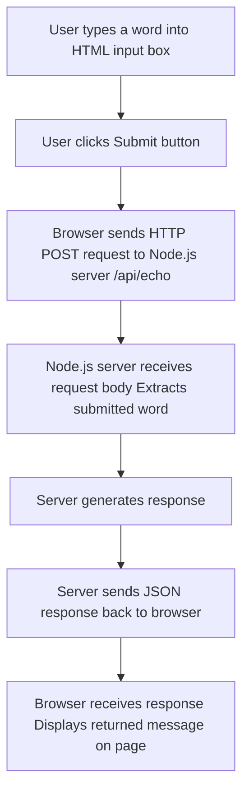

```mermaid
flowchart TD

    A[User types a word into HTML input box]
        --> B[User clicks Submit button]

    B --> C[Browser sends HTTP POST request to Node.js server /api/echo]

    C --> D[Node.js server receives request body Extracts submitted word]

    D --> E[Server generates response]

    E --> F[Server sends JSON response back to browser]

    F --> G[Browser receives response Displays returned message on page]

```
